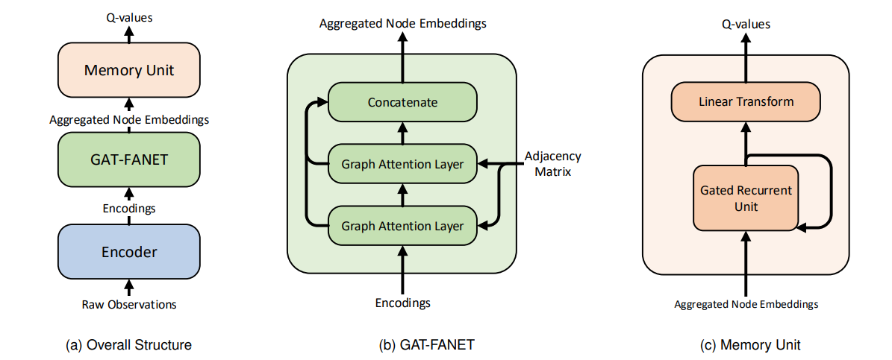

# Soft-DRGN

For [Chinese Readme](./README-zh.md).

This repository contains official PyTorch implementations for the following papers:

* Soft-DRGN：[Multi-UAV Navigation for Partially Observable Communication Coverage by Graph Reinforcement Learning](https://www.techrxiv.org/articles/preprint/Multi-UAV_Navigation_for_Partially_Observable_Communication_Coverage_by_Graph_Reinforcement_Learning/15048273/2) *(IEEE transactions on Mobile Computing, 2022)*
* [Space-Air-Ground Integrated Mobile Crowdsensing for Partially Observable Data Collection by Multi-Scale Convolutional Graph Reinforcement]() *(Entropy, 2022)*



# Usage

## Install（Linux or Windows）

```bash
conda create -n sdrgn python=3.7
conda activate sdrgn
conda install pytorch=1.8.0 -c pytorch
pip install -r requirements.txt
```

## Training (GPU）

We take training Soft-DRGN in [UAV mobile-base station (UAV-MBS)](https://www.techrxiv.org/articles/preprint/Multi-UAV_Navigation_for_Partially_Observable_Communication_Coverage_by_Graph_Reinforcement_Learning/15048273/2) as example：

```bash
export CONFIG=configs/scenarios/continuous_uav_mbs/sdrgn.yaml
CUDA_VISIBLE_DEVICES=0 python run.py --config=$CONFIG --exp_name=uav-mbs_sdrgn
```

The commandlines above will create a work directory at `<root_dir>/checkpoint/<exp_name>`, and the config file, tensorboard log, and model checkpoint will be stored there.

### Using TensorBoard

```bash
cd checkpoints/uav-mbs_sdrgn
tensorboard --logdir=./ --bind_all
```

## Visualization

Once you have trained a model using commandline above, you can visualize how your agent execute the task with command below:

```bash
CUDA_VISIBLE_DEVICES=0 python run.py --config=$CONFIG --exp_name=uav-mbs_sdrgn --display
```

## Evaluate the model

Once you have trained a model using commandline above, and now you want quantitative assessment:

```bash
CUDA_VISIBLE_DEVICES=0 python run.py --config=$CONFIG --exp_name=uav-mbs_sdrgn --evaluate --eval_result_name=out.csv
```

it will generate a out.csv file at checkpoints/uav-mbs_sdrgn, which record the test result in 100 runs.

# Supported functions

## Supported Algorithms

Algorithms

|           | Base config                        | Scenario-specific config         |
| :-------- | ---------------------------------- | -------------------------------- |
| DQN       | configs/configs_base/dqn.yaml      | configs/<env_name>/dqn.yaml      |
| DGN       | configs/configs_base/dgn.yaml      | configs/<env_name>/dgn.yaml      |
| AC-DGN    | configs/configs_base/ac_dgn.yaml   | configs/<env_name>/ac_dgn.yaml   |
| DRGN      | configs/configs_base/drgn.yaml     | configs/<env_name>/drgn.yaml     |
| AC-DRGN   | configs/configs_base/ac_drgn.yaml  | configs/<env_name>/ac_drgn.yaml  |
| Soft-DGN  | configs/configs_base/sdgn.yaml     | configs/<env_name>/sdgn.yaml     |
| SAC-DGN   | configs/configs_base/sac_dgn.yaml  | configs/<env_name>/sac_dgn.yaml  |
| Soft-DRGN | configs/configs_base/sdrgn.yaml    | configs/<env_name>/sdrgn.yaml    |
| SAC-DRGN  | configs/configs_base/sac_drgn.yaml | configs/<env_name>/sac_drgn.yaml |
| MAAC      | configs/configs_base/maac.yaml     | configs/<env_name>/maac.yaml     |
| HGN       | configs/configs_base/hgn.yaml      | configs/ctc/hgn.yaml             |

## Supported Scenario

| Scenario场                                       | Base config                         | Description                                                                                                            |
| ------------------------------------------------ | ----------------------------------- | ---------------------------------------------------------------------------------------------------------------------- |
| Surviving                                        | configs/survivng/env.yaml           | A group of homogeneous agents search and consume food in the map to avoid starvation                                   |
| Continuous UAV Mobile Base Station               | configs/continuous_uav_mbs/env.yaml | A swarm of UAV provides communication coverage for ground users                                                        |
| Continuous UAV Mobile Base Station with charging | configs/continuous_uav_mcs/env.yaml | A swarm of UAV provides communication coverage for ground users (Take charging and satellite into consideration）      |
| Collective Treasure Colloection                  | configs/ctc/env.yaml                | Reproduces the*Cooperative Treasure Collection (CTC) in the MAAC paper to test heterogeneous algorithms such as HGN* |

## How to add your own algorithm

1. in modules directory，define new network class, refer to [modules docs](docs/modules.md)
2. in agents directory，define new Agent class, refer to [agents docs](docs/agents.md)
3. in configs directory，add new yaml in base_configs, refer to [configs docs](docs/configs.md)
4. in configs directory，add new yaml in <scenario_name>directory for each algorithm.

## How to add your own scenarios

1. in scenarios directory, define new Environment class, refer to [scenarios docs](docs/scenarios.md)
2. in configs directory, add new env.yaml in <scenario_name>directory，refer to [configs docs](docs/configs.yaml)

## About heterogeneous algorithms and scenarios

refer to [hetero docs](docs/heterogeneous_madrl.md)

# Citation

If you find this repo helpful to your work, consider citing the following papers:

* Soft-DRGN

```
@article{ye2022sdrgn,
  author={Ye, Zhenhui and Wang, Ke and Chen, Yining and Jiang, Xiaohong and Song, Guanghua},
  journal={IEEE Transactions on Mobile Computing}, 
  title={Multi-UAV Navigation for Partially Observable Communication Coverage by Graph Reinforcement Learning}, 
  year={2022},
  volume={},
  number={},
  pages={1-1},
  doi={10.1109/TMC.2022.3146881}}
```

* MS-SDRGN

```
@article{ren2022ms-sdrgn,

}
```
